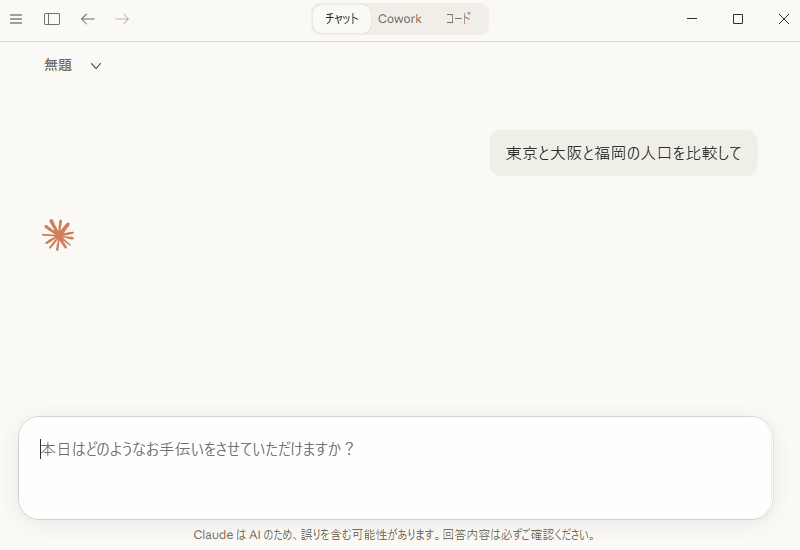

# japan-data-mcp

<!-- mcp-name: io.github.Izyuusya/japan-data-mcp -->

日本の地域分析・比較に特化した MCP（Model Context Protocol）サーバーです。

[e-Stat（政府統計の総合窓口）](https://www.e-stat.go.jp/)、
[国税庁 法人番号公表サイト](https://www.houjin-bangou.nta.go.jp/)、
[国土交通省 不動産情報ライブラリ](https://www.reinfolib.mlit.go.jp/) の API を通じて
日本の公的データにアクセスし、人間が読みやすい形式に自動変換して返します。

<p align="center">
  
</p>

> **解説記事**: [e-Stat APIを100回叩いてわかった、政府データが宝の持ち腐れな件｜DATA POPCORN](https://datapopcorn.jp/estat-api-japan-data-mcp/)

## 特徴

- **コード自動変換** — e-Stat が返すコード番号（`13000` → `東京都`）を名称に自動変換
- **全国市区町村対応** — 47 都道府県 + 20 政令指定都市 + 全国約 1,700 市区町村に対応
- **地域比較** — 複数地域のデータをピボットテーブルで並べて比較
- **プリセット分析** — 統計表 ID を知らなくても、地域名だけで人口データや地域プロファイルを取得
- **法人検索** — 法人名から企業の法人番号・所在地・種別を検索
- **不動産取引価格** — 地域の不動産取引データと価格サマリーを取得
- **データ検証** — 全ての出力にデータ出典・検証リンク・取得日時を付与

## 提供ツール一覧

### 統計データ（e-Stat API）

| ツール名 | 説明 |
| --- | --- |
| `search_statistics` | キーワードで統計表を検索 |
| `get_regional_data` | 指定地域の統計データを取得（`summary=True` で最新データのみ） |
| `compare_regions` | 複数地域のデータを比較（ピボットテーブル） |
| `get_meta_info` | 統計表のメタ情報（分類コード体系）を確認 |
| `resolve_area` | 地域名 → 地域コードを検索 |
| `list_available_stats` | 統計分野コードの一覧を表示 |
| `get_population` | 地域の人口データを自動取得（プリセット） |
| `get_regional_profile` | 地域の総合プロファイルを自動取得（プリセット） |

### 法人情報（法人番号 Web-API）

| ツール名 | 説明 |
| --- | --- |
| `search_corporations` | 法人名で企業を検索（地域・種別で絞り込み可） |
| `get_corporation` | 法人番号から企業の詳細情報を取得 |

### 不動産取引（不動産情報ライブラリ API）

| ツール名 | 説明 |
| --- | --- |
| `get_real_estate_transactions` | 不動産取引価格情報を取得（価格サマリー付き） |

## セットアップ

### 1. インストール

```bash
# uv（推奨）
uv add japan-data-mcp

# pip
pip install japan-data-mcp

# ソースから
git clone https://github.com/Izyuusya/japan-data-mcp.git
cd japan-data-mcp
uv sync
```

### 2. APIキー設定

対話的セットアップコマンドで簡単に設定できます:

```bash
japan-data-mcp setup
```

画面の案内に従って API キーを入力すると `.env` ファイルが自動生成されます。

#### 必要なAPIキー

| 環境変数 | API | 必須 | 取得先 |
| --- | --- | --- | --- |
| `ESTAT_APP_ID` | e-Stat API | **必須** | [e-Stat API ガイド](https://www.e-stat.go.jp/api/api-info/api-guide) |
| `CORP_APP_ID` | 法人番号 Web-API | 任意 | [法人番号公表サイト](https://www.houjin-bangou.nta.go.jp/webapi/)（発行まで2〜4週間） |
| `REALESTATE_API_KEY` | 不動産情報ライブラリ API | 任意 | [不動産情報ライブラリ](https://www.reinfolib.mlit.go.jp/api/request/) |

- **e-Stat API は必須** です。未設定の場合サーバーが起動しません。
- 法人番号・不動産 API は任意です。未設定でも他の機能は正常に動作します。
- 全て **無料** で取得できます。

#### 手動設定する場合

プロジェクトルートに `.env` ファイルを作成:

```
ESTAT_APP_ID=あなたのアプリケーションID
CORP_APP_ID=あなたのアプリケーションID
REALESTATE_API_KEY=あなたのAPIキー
```

### 3. サーバー起動

```bash
japan-data-mcp
```

## Claude Desktop での設定

`claude_desktop_config.json` に以下を追加してください。

### uv でインストールした場合

```json
{
  "mcpServers": {
    "japan-data-mcp": {
      "command": "uv",
      "args": ["run", "japan-data-mcp"],
      "env": {
        "ESTAT_APP_ID": "あなたのアプリケーションID",
        "CORP_APP_ID": "あなたのアプリケーションID（任意）",
        "REALESTATE_API_KEY": "あなたのAPIキー（任意）"
      }
    }
  }
}
```

### pip でインストールした場合

```json
{
  "mcpServers": {
    "japan-data-mcp": {
      "command": "japan-data-mcp",
      "env": {
        "ESTAT_APP_ID": "あなたのアプリケーションID",
        "CORP_APP_ID": "あなたのアプリケーションID（任意）",
        "REALESTATE_API_KEY": "あなたのAPIキー（任意）"
      }
    }
  }
}
```

> **ヒント**: `.env` ファイルに設定済みの場合は `env` セクションを省略できます。

## 使用例

### 地域の人口データを取得する

```
get_population("札幌市")
```

### 複数地域を比較する

```
compare_regions(
    stats_data_id="0003433219",
    areas=["札幌市", "仙台市", "福岡市"]
)
```

### 法人を検索する

```
search_corporations("トヨタ", area="愛知県")
```

### 不動産取引価格を調べる

```
get_real_estate_transactions("札幌市", year=2023)
```

### 地域の総合プロファイルを取得する

```
get_regional_profile("東京都")
```

人口・経済・労働など複数分野のデータをまとめて取得し、1 つのレポートとして返します。

## 開発

```bash
# 依存関係のインストール
uv sync

# テスト実行
uv run python -m pytest tests/ -v

# サーバーの直接起動
uv run japan-data-mcp
```

## 出典

このプロジェクトは以下の API を利用しています:

- [e-Stat（政府統計の総合窓口）](https://www.e-stat.go.jp/) — 統計データは [CC BY 4.0](https://creativecommons.org/licenses/by/4.0/deed.ja) で提供
- [国税庁 法人番号公表サイト Web-API](https://www.houjin-bangou.nta.go.jp/webapi/) — 法人番号・法人情報
- [国土交通省 不動産情報ライブラリ](https://www.reinfolib.mlit.go.jp/) — 不動産取引価格情報

> このサービスは各 API 提供元のデータを利用していますが、サービスの内容は各機関によって保証されたものではありません。

## ライセンス

MIT License
